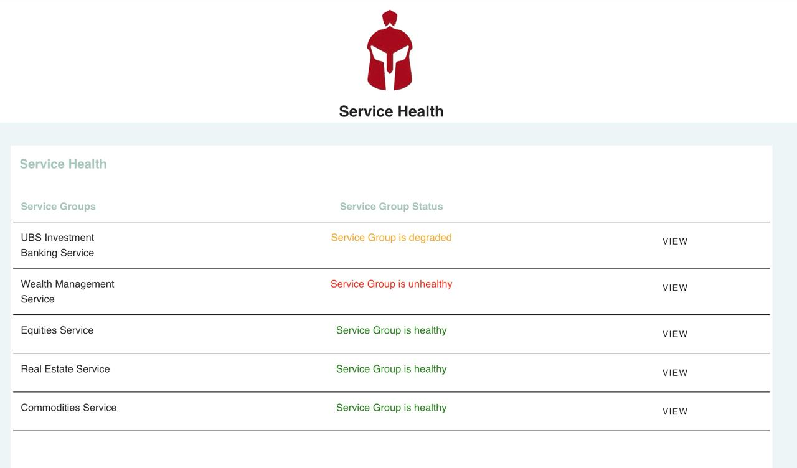
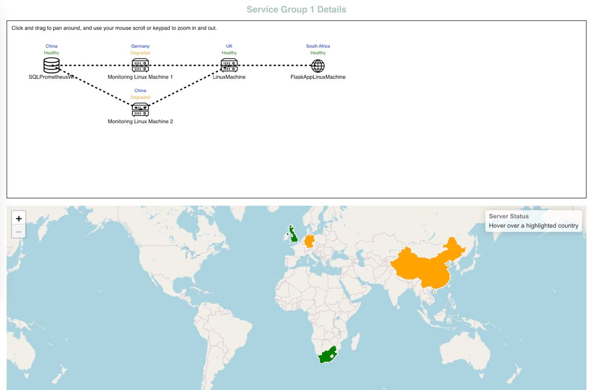
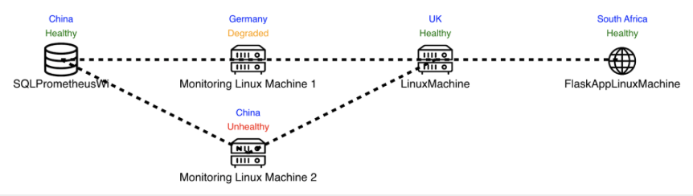
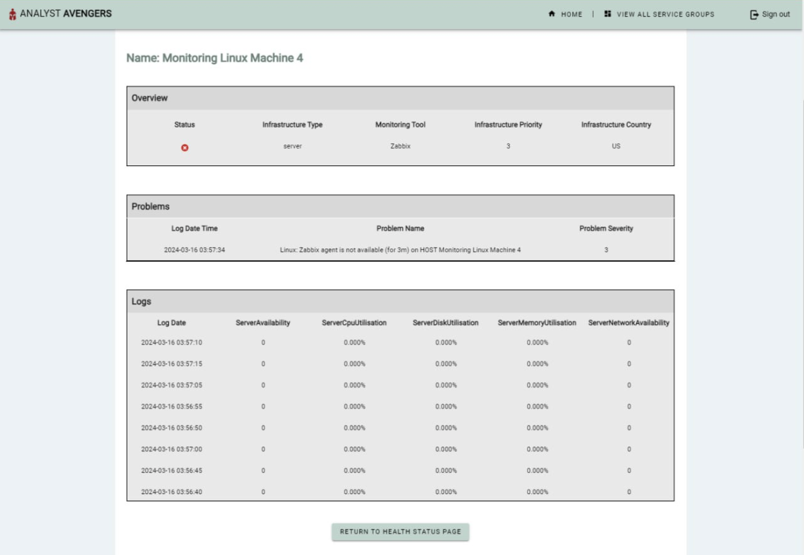
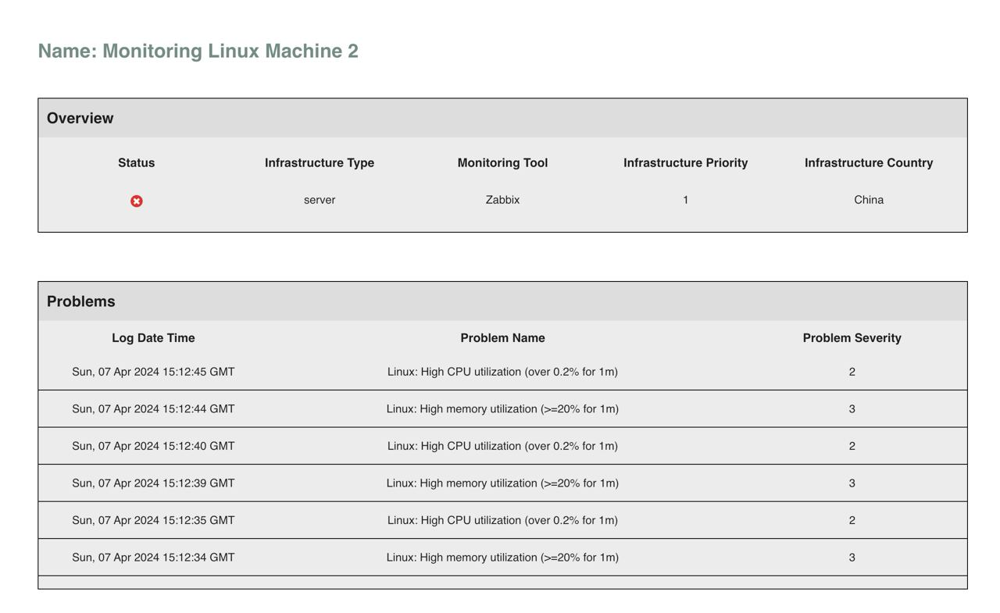
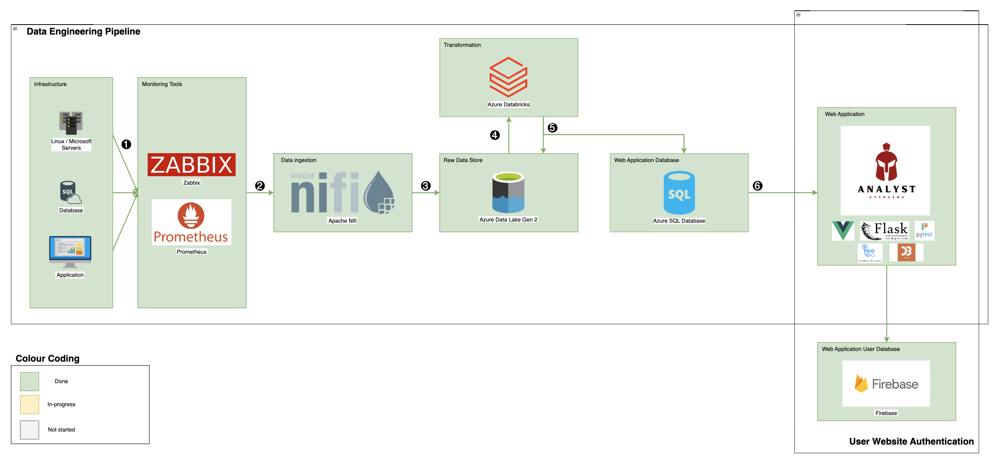

# Data Engineering and Full-Stack Web App Project

NOTE: there is no code because the code belongs to the client now.

## Introduction

Created a web application to help the client easily check the health status of their services and the underlying infrastructure (servers, applications, databases) of each service.

The web application provides 3 layers of information - 1) high-level, 2) mid-level and 3) low-level.

- High-level displays the health status of services.
- Mid-level displays the network of all infrastructure powering that service and a geographical map of where they are located.
- Low-level displays the problem logs of the infrastructure (if it experiences any error) and metric logs.

This web application is powered by a data pipeline ingesting, transforming and loading data every 5 seconds from the monitoring tools.

### Pictures

#### High-level View

#### Mid-level View

#### Low-level View

## Architecture Diagram

## Tech Stack

### Tech Stack for Data Pipeline

- Azure Virtual Machines (deployment of servers, web app, database)
- Prometheus (monitoring tool)
- Zabbix (monitoring tool)
- Apache Nifi (data ingestion)
- Azure Databricks (data transformation)
- Azure Data Lake Gen 2 (raw data storage)
- Azure SQL Database (web app database)

### Tech Stack for Web App

- Vue.JS (frontend)
- Flask (backend)
- Azure SQL database (web app database)
- Pytest (unit and integration testing)
- Github Actions (CI pipeline)
- Firebase (user authentication)
